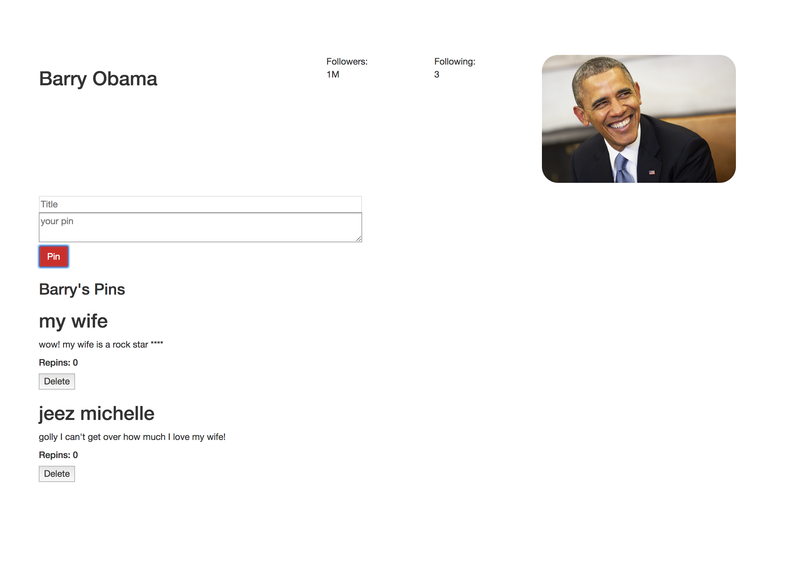

# Presidential Pinterest

By _Brittany Kerr_ [e-mail me](<mailto:kerrbrittany9@gmail.com>)

## Description

What has Barack Obama been doing since he left office? Pinning! Or perhaps you can help him pin. The user an enter a title and topic to pin and it will appear on his feed. It will also appear on Michelle's feed too! What a couple.

Users can add a pin to Mr Obama's page.

Users can add or delete and the list will show on his page!

Wait! It will also get routed to Michelle's page too!

## Prerequisites

You will need the following things properly installed on your computer:
* [Node.js](https://nodejs.org/) (with NPM)

## Installation

* Open Github site in your browser and copy: https://github.com/kerrbrittany9/pinterest
* Open Terminal on your computer and follow these steps:
  * `$ cd desktop`
  * `$ git clone <paste repository-url>`
  * `$ cd pinterest`
  * `$ npm install`

## Development server

Run `npm start` for a dev server. Navigate to `http://localhost:8080/`. The app will automatically reload if you change any of the source files.

## Technologies Used

React.js, Redux, JavaScript, Babel, react-hot-loader, webpack, Node.js, CSS, HTML
